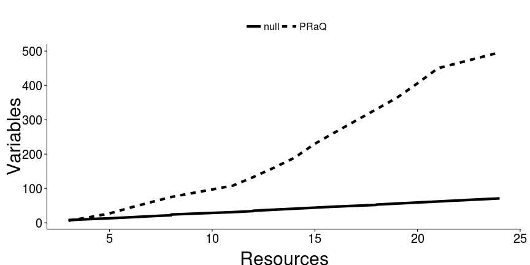
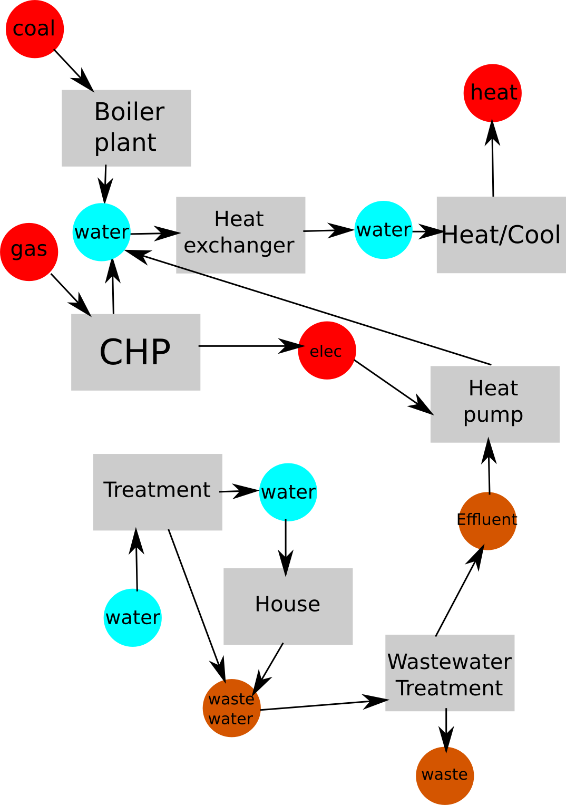
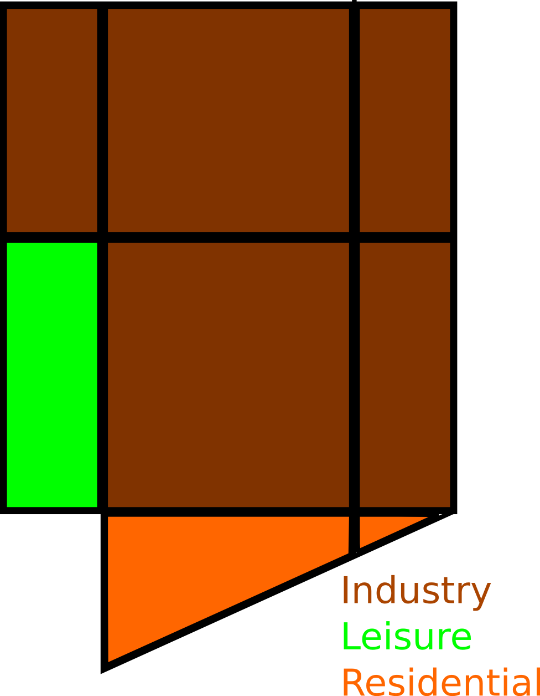
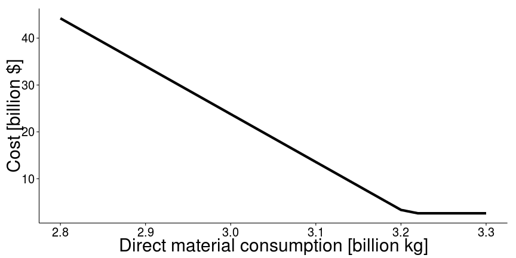

```
## Find out what's changed in ggplot2 with
## news(Version == "0.9.3.1", package = "ggplot2")
## Loading required package: plyr
## 
## Attaching package: 'reshape'
## 
## The following object(s) are masked from 'package:plyr':
## 
##     rename, round_any
```




--- &twocol

## Case study: Shann Gu

$$\mbox{imports} + \mbox{production} = \mbox{exports} + \mbox{demand}$$

*** =left



*** =right



---

## Results




--- .class #id 

## Future work

- Explore nonlinear options
- Develop case study
	- add resource storage
	- finer spatial and temporal discretisation
- Build pre- and post-processors
- Relate to urban metabolism literature

--- bg:black
